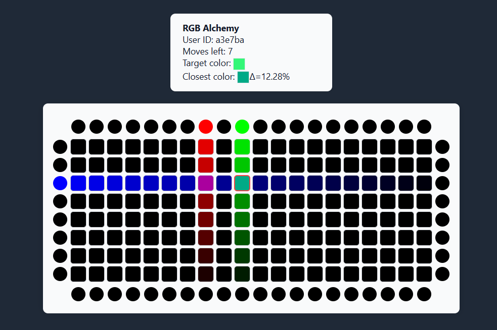

## ✨ Game Overview

RGB Alchemy is a color-mixing puzzle game where your goal is to create a color that matches the target color within a limited number of moves. The game combines elements of color theory, strategy, and spatial reasoning.

## 📸 Screenshot



### Game Mechanics

1. **Initial Setup**
   - Game board consists of a grid of tiles (row × column) surrounded by source circles
   - All tiles and sources start as black (rgb(0, 0, 0))
   - A target color is randomly generated
   - Limited number of moves available

2. **Color Mixing Rules**
   - First 3 moves: Click sources to paint them red, green, or blue
   - After 3 moves: Drag tiles to sources to create new colors
   - Colors mix based on relative distances and RGB values
   - Color normalization ensures values stay within valid RGB range

3. **Victory Condition**
   - Win by creating a color that matches the target color
   - Color difference must be less than 10%
   - Color difference is calculated using RGB distance formula

## 🚀 Getting Started

### Prerequisites

- Node.js (v20.19.0 or higher)
- npm or yarn package manager

### Installation

1. Clone the repository:
```bash
git clone https://github.com/intelfan828/color-alchemy.git
cd color-alchemy/color-alchemy-client/
```

2. Install dependencies:
```bash
npm install
# or
yarn install
```

3. Start the development server:
```bash
npm start
# or
yarn start
```

The game will be available at `http://localhost:3000`

## 🛠️ Technology Stack

- React
- TypeScript
